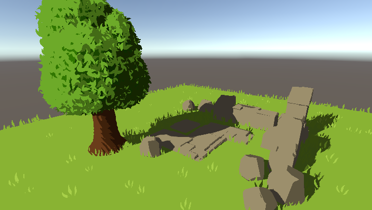

# Introduction
Make stylized rendering shader graph in Unity URP

## PixelArt
Use gradient color processing objects, and Graphics.DrawMeshInstanced drawing a large number of leaves with varying positions, rotations, and scales.

## Stylized Water
Follow the tutorial https://ameye.dev/notes/stylized-water-shader/ to make a beautiful stylized water
